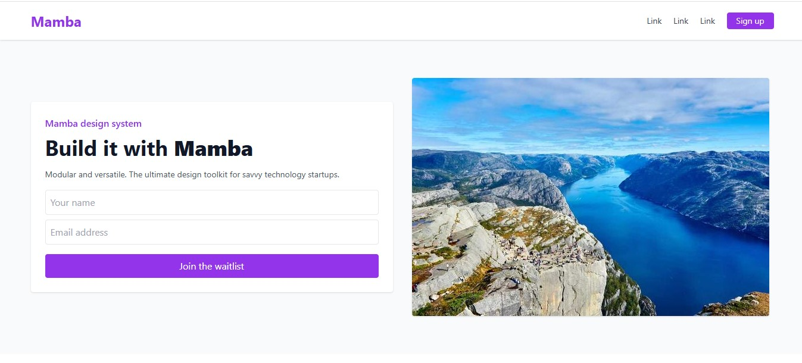
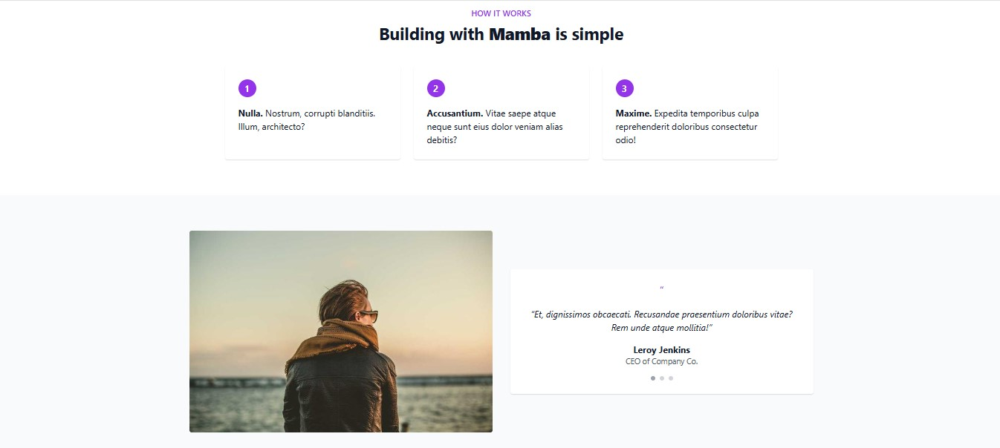
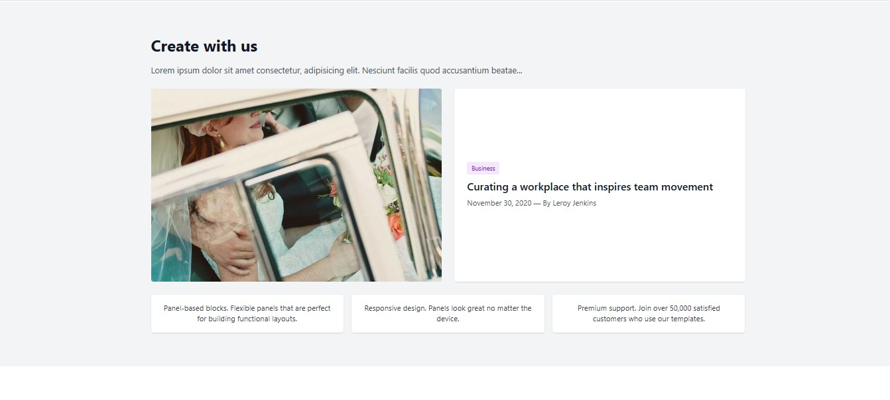
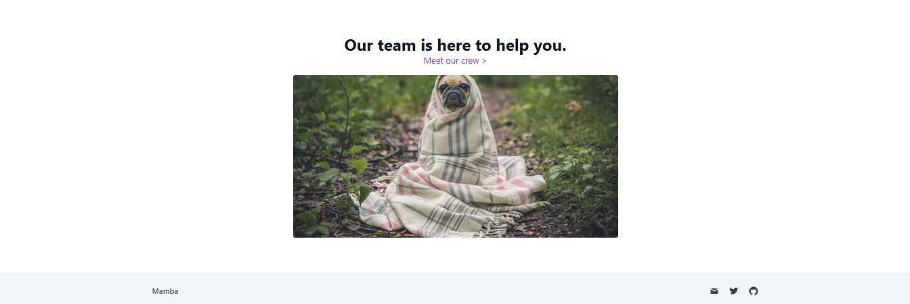

# 🟣 Mamba UI - Landing Page

Bu proje, HTML ve Tailwind CSS kullanılarak hazırlanmış mobil uyumlu basit bir açılış sayfasıdır.

## 📌 İçerik

- Başlık ve açıklama alanı
- E-posta formu
- 3 adımlı bilgi kartları
- Kullanıcı yorumu (testimonial) bölümü
- Blog yazısı ve kısa bilgiler
- Takım (ekip) görseli
- Alt bilgi (footer) ve sosyal medya ikonları

## 🛠 Kullanılan Teknolojiler

- HTML5  
- [Tailwind CSS](https://tailwindcss.com)  
- Responsive tasarım yapısı  
- SVG ikonlar
