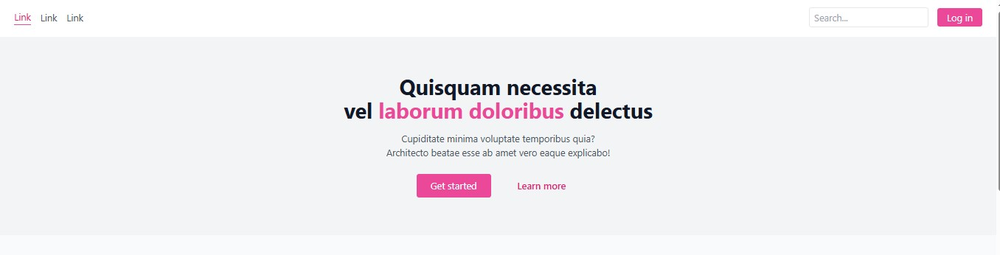
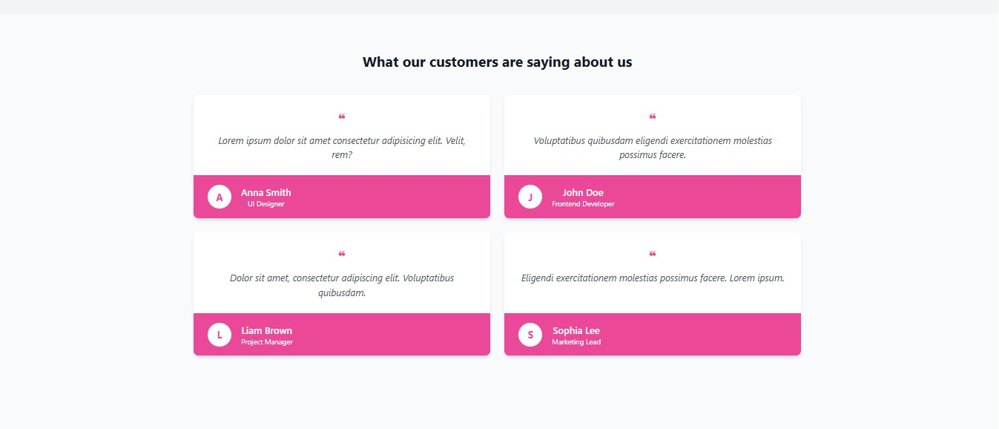
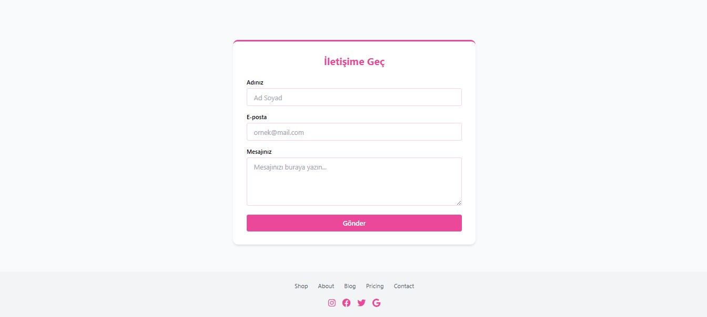

# 🌸 Review Page - Kullanıcı Yorumları Web Sayfası

Bu proje, TailwindCSS kullanılarak hazırlanmış sade ve şık bir kullanıcı yorumları (testimonial) sayfasıdır. Sayfa içinde navbar, hero alanı, kullanıcı yorumları (kart yapısı), iletişim formu ve footer yer almaktadır.

---

## 📌 İçerik

- 🔗 Üst menü (Navbar)
- 🖼️ Giriş alanı (Hero section)
- 🗨️ Kullanıcı yorum kartları (4 adet)
- 📬 İletişim formu (Ad, e-posta, mesaj)
- 📎 Sosyal medya ikonları (Footer)

---

## 🎨 Kullanılan Teknolojiler

- [TailwindCSS](https://tailwindcss.com/) (utility-first CSS framework)
- HTML5
- Font Awesome (ikonlar için)

---

## 🎯 Temalar ve Tasarım

- Ana tema: **Pembe & Turuncu** tonları
- Responsive (mobil uyumlu) tasarım
- Yorum kartları sade ve anlaşılır yapıdadır
- İletişim formu ve footer genel tema ile uyumludur

---

## 📷 Ekran Görüntüsü

 

